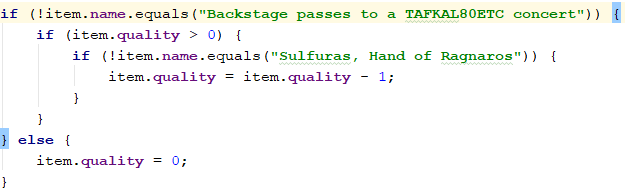
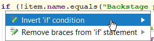
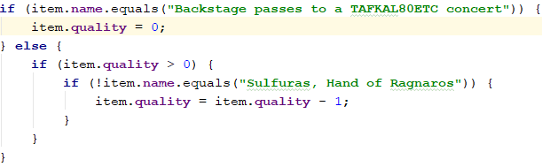

# Stage 1: Honest Names
This is the Gilded Rose after refactoring the names from **missing** to **nonsense**. Since, nonsense names can be 
viewed as a step backwards, nonsense names are automatically refactored to **honest** before each commit.

## Prerequisite
Before attempting to name the code I perform the following IDE safe refactorings. By performing them, it makes reasoning about the resulting code easier.

### Replace for-loop with for-each loop refactoring
Using `item` instead of `items[i]` increases the readability.

### Can be replaced with '0' refactoring
Using `0` instead of `item.quality - item.quality`.

### Invert negative if statements refactoring
#### Negative If Statement Example

#### Invert dialog

#### Inverted example
